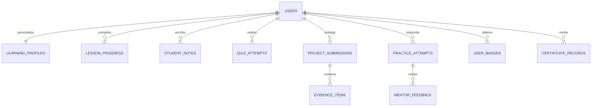

# Arquitectura técnica y modelo de dominio

## Enfoque de contenido y datos

El currículo editorial se mantendrá versionado en el repositorio como datos TypeScript tipados. Esta decisión permite revisar material trilingüe mediante control de versiones, conservar equivalencia entre idiomas y actualizar lecciones sin depender de procesos de carga manual. La base de datos almacenará únicamente datos personales y generados por el estudiante: progreso, notas, entregas, evidencias, intentos y resultados.

Cada ítem editorial tendrá un identificador estable y tres campos equivalentes de idioma (`es`, `pt`, `en`). El selector cambia la capa de presentación sin modificar los identificadores de progreso. Así, una lección iniciada en português puede finalizarse en inglés sin duplicar logros ni calificaciones.

## Entidades persistentes

| Entidad | Finalidad | Datos principales | Propiedad y protección |
|---|---|---|---|
| `learning_profiles` | Preferencias y acumulados por estudiante | idioma, puntos, meta semanal, fecha de actualización | Una fila por identidad anónima o usuario autenticado |
| `lesson_progress` | Seguimiento de cada lección | lección, estado, tiempo, finalización | Único por usuario y lección |
| `student_notes` | Notas privadas | lección opcional, título, contenido, marca temporal | Solo su autor puede consultar o editar |
| `quiz_attempts` | Intentos evaluables | quiz, respuestas, nota, aprobado, fecha | Historial perteneciente al estudiante |
| `project_submissions` | Entregas de proyectos y capstone | proyecto, resumen, reflexión, estado, autoevaluación | Propiedad del estudiante; visible solo a su autor y administradores autorizados |
| `evidence_items` | Evidencias adjuntas o enlaces | entrega, tipo, etiqueta, URL o clave de archivo, MIME, tamaño | Metadatos mínimos; archivo fuera de la base de datos |
| `practice_attempts` | Respuestas del Practice Lab | caso, respuesta, fase de ayuda, fecha | Solo su autor puede leerla |
| `mentor_feedback` | Orientación formativa posterior al intento | intento, fase, contenido, modelo, fecha | Se conserva para el estudiante y no se usa como evaluación oficial |
| `user_badges` | Hitos de dominio | badge, fecha de obtención | Único por usuario y badge |
| `certificate_records` | Reconocimientos internos emitidos | código, emisión, instantánea de resultados | Solo si se cumplen los requisitos; no afirma acreditación externa |

## Relaciones principales

## Estados y reglas de negocio

Las lecciones podrán estar `not_started`, `in_progress` o `completed`. Completar una lección concede puntos una única vez. Los quizzes se califican del 0 al 100 y se clasifican como insuficiente, aprobado, competente, avanzado o excelencia. Una respuesta correcta no se enviará al cliente antes de registrar el intento.

Una práctica empieza sin ayuda. Después de que el estudiante guarde una respuesta no vacía, la aplicación permite solicitar orientación en dos niveles: **pistas** y **aproximación posible**. La respuesta del mentor debe referenciar la tarea y la rúbrica; no puede dar una solución completa en el primer contacto. El resultado se etiqueta como orientación, no como veredicto definitivo.

Los puntos derivan de acciones verificables: lecciones completadas, quizzes aprobados, prácticas reflexionadas y proyectos entregados. Los badges se calculan a partir de condiciones explícitas, no de valores decorativos ni de opiniones del sistema.

## Contratos de servicio

| Área | Lectura | Escritura | Control de acceso |
|---|---|---|---|
| Catálogo curricular | Programa, módulos, lecciones y recursos | No aplica desde la UI | Público; datos versionados |
| Aprendizaje | Dashboard, progreso, próxima actividad | Completar lección, actualizar perfil | Identidad de sesión anónima o usuario OAuth, siempre por `userId` del contexto |
| Evaluación | Quizzes y rúbricas | Registrar intento de quiz | Usuario autenticado; la corrección ocurre en servidor |
| Notas | Notas propias | Crear, editar y eliminar notas propias | Usuario autenticado y propietario |
| Proyectos | Briefs, entregas y portfolio propio | Guardar borrador, entregar, autoevaluar | Usuario autenticado y propietario |
| Evidencias | Metadatos de la entrega propia | Subir archivo o guardar enlace | Usuario autenticado y propietario de la entrega |
| Mentoría | Casos y orientaciones propias | Registrar intento y solicitar nivel de ayuda | Identidad de sesión anónima o usuario OAuth y propietario |
| Certificado | Elegibilidad y registro propio | Emitir solo tras validación del servidor | Usuario autenticado; reglas no manipulables por cliente |

## Identidad anónima, IA y voz

El acceso al aula no depende de OAuth. Cuando una petición llega sin una sesión válida, el servidor genera un `openId` con 32 bytes aleatorios, crea o actualiza la fila correspondiente en `users` con `loginMethod: anonymous` y emite un JWT firmado en una cookie HttpOnly con duración de un año. La interfaz muestra una versión truncada del identificador y permite copiarlo para conservar una referencia manual; la cookie sigue siendo el mecanismo de continuidad. OAuth permanece disponible como vía explícita para operaciones administrativas, pero no se presenta como requisito para estudiar.

El asistente global ofrece mentoría contextual y reescritura de textos mediante el modelo de servidor `gpt-5-mini`; las credenciales nunca se envían al navegador. La entrada de voz y la lectura en voz alta usan las APIs nativas del navegador, de forma que el alumno conserva control de iniciar, detener y repetir la reproducción. El texto sigue siendo la fuente principal y los vídeos externos se enlazan desde su editor original.

## Evidencias y carga segura

Los archivos no se guardan dentro de columnas de la base de datos. El servidor verificará que la entrega pertenezca a la persona autenticada, aplicará una lista permitida de formatos (`pdf`, `png`, `jpeg`, `webp`, `txt`, `md`, `docx`) y un límite de 10 MB por archivo. El nombre original se normaliza y la clave de almacenamiento incorpora el identificador del usuario, el identificador de la entrega y un sufijo único. La base de datos conserva solo metadatos esenciales y la clave del objeto.

Los enlaces de evidencias se validan como URL HTTP(S) antes de guardarlos. La interfaz advertirá que no se deben adjuntar datos personales de participantes de investigación, información confidencial, credenciales ni documentos con permisos de terceros. Una evidencia se mantiene privada de forma predeterminada; su uso en el portfolio requerirá una acción explícita posterior de la persona autora.

## Estrategia de calidad

Los procedimientos del servidor usarán validación `zod`, autenticación obligatoria para los datos personales y consultas filtradas por el usuario del contexto. Las funciones de puntuación, clasificación, elegibilidad y validación de evidencias serán funciones puras cubiertas por Vitest. El cliente consumirá los procedimientos tipados para evitar rutas no validadas y mostrará estados de carga, éxito, error y vacío.
